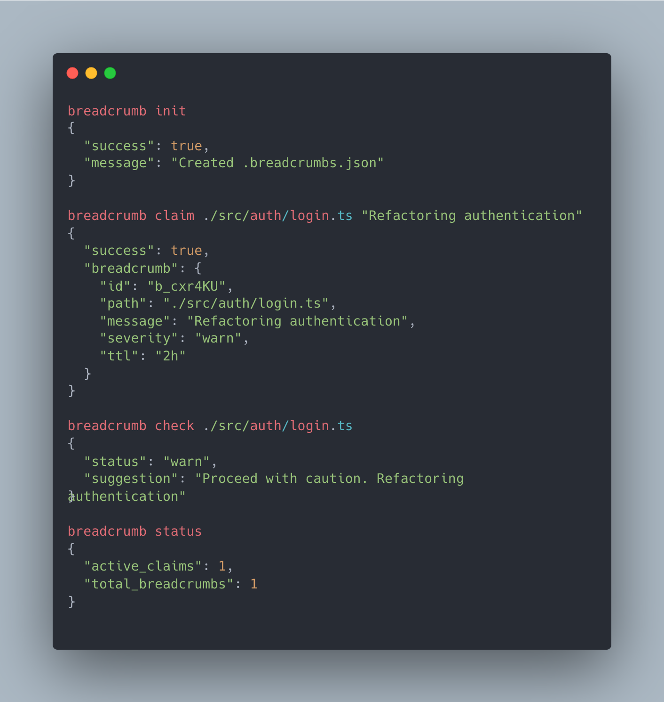

# Breadcrumb

[](https://www.npmjs.com/package/breadcrumb-cli)
[](https://opensource.org/licenses/MIT)
[](https://www.typescriptlang.org/)
[](https://bun.sh/)



**Agents leave notes for other agents.**

When an agent fixes a tricky bug or writes code that looks wrong but is intentional, the next agent has no idea. It sees "dead code" and helpfully cleans it up. Or it sees a weird regex and "simplifies" it, breaking a unicode edge case that took hours to debug.

Breadcrumb fixes this. Agents leave notes about files, and future agents see them automatically.

```bash
# Agent leaves a note after fixing a tricky bug
breadcrumb add ./src/parser.ts "Regex handles unicode edge cases, don't simplify"

# Future agent reads the file → sees the note automatically
📝 BREADCRUMB: Regex handles unicode edge cases, don't simplify
```

## Installation

**Requires [Bun](https://bun.sh) runtime.**

```bash
# Install Bun (if you don't have it)
curl -fsSL https://bun.sh/install | bash

# Install breadcrumb
bun add -g breadcrumb-cli
```

## Quick Start

```bash
# Initialize in your repo
breadcrumb init

# Add a note about a file
breadcrumb add ./src/auth.ts "OAuth flow depends on specific token format"

# See notes on a file
breadcrumb check ./src/auth.ts

# List all notes
breadcrumb ls

# Remove a note
breadcrumb rm ./src/auth.ts
```

## Why Not Just Use Comments?

Comments are passive — they sit in a file hoping to be noticed. Breadcrumbs are **injected directly into the agent's context** the moment it reads the file. They can't be skimmed over or missed.

Also:
- **Comments aren't discoverable** — `breadcrumb ls` shows all notes in a repo
- **Comments can't span files** — One breadcrumb can cover an entire directory

## When to Leave Notes

- Code that looks like it could be simplified but shouldn't be
- Bug fixes for edge cases that aren't obvious
- Intentional workarounds
- Security-critical patterns (SQL injection prevention, etc.)
- Performance tuning that looks "overengineered"

## Example: Protecting Critical Code

```bash
# Money calculations - integers avoid floating point errors
breadcrumb add ./src/utils/money.js "All money as integers (cents) to avoid floating point errors. Ceiling for tax is legally required."

# API retry logic tuned for rate limiting
breadcrumb add ./src/api/client.js "Retry delays tuned for rate limiting - 100ms/500ms/2s/5s matches API provider's backoff recommendations"

# SQL injection prevention
breadcrumb add ./src/db/query.js "CRITICAL: Parameterized queries prevent SQL injection. Never use string interpolation for values."
```

Now when an agent tries to "simplify" this code:

| Request | Agent Response |
|---------|----------------|
| "Use floating point for money" | ❌ Refuses - cites precision errors |
| "Simplify retry to fixed 1s delay" | ⚠️ Warns about rate limit tuning |
| "Use template literals for SQL" | ❌ Hard refuses - SQL injection risk |
| "Do a full code review and simplify" | ✅ Reports all code is intentionally designed |


## Commands

| Command | Description |
|---------|-------------|
| `init` | Create `.breadcrumbs.json` in current repo |
| `add <path> <message>` | Add a note (warns about overlaps) |
| `edit <path-or-id>` | Edit a note in place |
| `rm <path>` | Remove a note |
| `check <path>` | See notes on a file |
| `search <query>` | Find notes by content |
| `coverage [path]` | Show breadcrumb coverage stats |
| `ls` | List all notes |
| `status` | Quick overview (counts) |
| `prune` | Remove expired notes |

### Add Options

```bash
breadcrumb add <path> <message> [options]
  -s, --severity <level>   # info (default) or warn
  -e, --expires <date>     # Expiration date (ISO 8601)
  --ttl <duration>         # Time-to-live (30s, 5m, 2h, 7d)
  --no-overlap-check       # Skip overlap detection
```

### Edit Options

```bash
breadcrumb edit <path-or-id> [options]
  -m, --message <text>     # Replace message
  -a, --append <text>      # Append to message
  -s, --severity <level>   # Change severity
  -e, --expires <date>     # Set expiration
  --ttl <duration>         # Set TTL
  --clear-expiration       # Remove expiration
```

### Search Options

```bash
breadcrumb search <query> [options]
  -r, --regex              # Treat query as regex
  -c, --case-sensitive     # Case-sensitive literal search
  -i, --ignore-case        # Case-insensitive regex search
  -p, --path <segment>     # Filter by path segment
  -s, --severity <level>   # Filter by severity
```

### Coverage Options

```bash
breadcrumb coverage [path] [options]
  -g, --glob <pattern>     # File pattern (default: **/*)
  --show-covered           # List covered files
  --show-uncovered         # List uncovered files
  -l, --limit <n>          # Max files to list (default: 20)
```

## Claude Code Plugin

For Claude Code users, the plugin auto-shows notes when reading files:

```bash
/plugin marketplace add tylergibbs1/breadcrumb
/plugin install breadcrumb@breadcrumb-marketplace
```

The plugin:
- Auto-installs the CLI if not present
- Auto-initializes `.breadcrumbs.json` on session start
- Injects notes into Claude's context when reading files
- Claude acknowledges notes when they conflict with the current task

## Vendor Agnostic

Breadcrumb works with **any AI agent system** that can run shell commands.

| Component | Requirement |
|-----------|-------------|
| CLI (`breadcrumb`) | Bun runtime |
| `.breadcrumbs.json` | Plain JSON - works everywhere |
| Claude Code plugin | Optional integration |

For other tools (Cursor, Windsurf, Aider), add to your system prompt or equivalent:
- Check for notes before editing: `breadcrumb check <file>`
- Leave notes after non-obvious changes: `breadcrumb add <file> "message"`

## Storage

Notes are stored in `.breadcrumbs.json` at repo root:

```json
{
  "version": 2,
  "breadcrumbs": [
    {
      "id": "b_1a2b3c",
      "path": "src/utils/money.js",
      "pattern_type": "exact",
      "message": "All money as integers (cents) to avoid floating point errors",
      "severity": "info",
      "added_by": { "agent_id": "agent" },
      "added_at": "2026-01-10T14:30:00Z"
    }
  ]
}
```

## License

MIT
